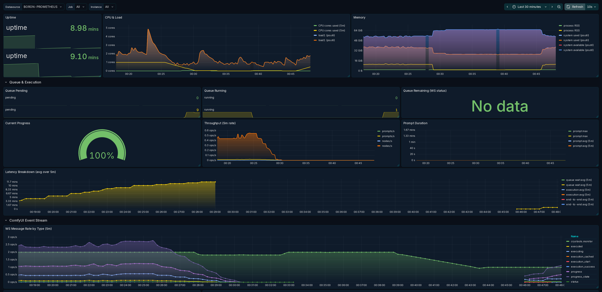

# ComfyUI Prometheus Exporter (custom node)

This is a standalone ComfyUI custom node that creates a Prometheus-compatible metrics endpoint within the ComfyUI installation.

## <u>Requirements</u>

The only requirement for basic functionality is to have the API on your installation enabled.

#### Optional dependencies

The exporter works without extra dependencies, but it will export more metrics if these are available:

- `psutil` (better process + system metrics)
- `pynvml` (NVIDIA GPU metrics via NVML)

## <u>Installation</u>

1. Clone this repository into your ComfyUI`custom_nodes`folder.

2. Restart ComfyUI.

3. Open in a browser:`http://<comfyui-host>:8188/metrics`

## <u>Environment Variables</u>

You can create a `.env` file in the same folder as `exporter.py` (next to `__init__.py`).

An example is included as `.env.example`.

Optionally, point to a custom env file path with:

- `COMFY_PROM_ENV_FILE=/absolute/path/to/file.env`

The exporter will **not** override variables already present in the process environment.

- `COMFY_PROM_METRICS_PATH` (default: `/metrics`)
- `COMFY_PROM_API_BASE` (default: `http://127.0.0.1:8188`) Used for API fallbacks like `/api/queue` and `/api/system_stats`. If you do **not** set this, the exporter will try to auto-detect the correct base from the incoming `/metrics` request host/port.
- `COMFY_API_KEY` Optional header for those API calls (`X-API-Key`).
- `COMFY_PROM_CACHE_TTL_SECONDS` (default: `2.0`) Cache for fast-changing metrics.
- `COMFY_PROM_SYSSTATS_TTL_SECONDS` (default: `10.0`) Cache for `/api/system_stats`.
- `COMFY_PROM_LOG_LEVEL` (default: `info`) One of `debug`, `info`, `warn`, `error`.

## <u>Prometheus Config</u>

```yaml
scrape_configs:
  - job_name: 'comfyui'
    static_configs:
      - targets:
        - 127.0.0.1:8188  # ComfyUI URL and Port.
    metrics_path: /metrics
```

## 

## <u>List of Metrics</u>

| Metric                                                                   | Recommended Grafana panel style | Description                                                                                          |
| ------------------------------------------------------------------------ | ------------------------------- | ---------------------------------------------------------------------------------------------------- |
| `comfyui_exporter_info{version,path}`                                    | Stat                            | Exporter build info (value `1`).                                                                     |
| `comfyui_uptime_seconds`                                                 | Time series                     | Uptime of the ComfyUI process.                                                                       |
| `comfyui_queue_pending`                                                  | Stat                            | Number of pending prompts (queue).                                                                   |
| `comfyui_queue_running`                                                  | Stat                            | Number of running prompts (queue).                                                                   |
| `comfyui_queue_remaining`                                                | Stat                            | Queue remaining from WS `status` events (best-effort).                                               |
| `comfyui_active_prompts`                                                 | Stat                            | Prompts currently executing (best-effort; typically 0/1).                                            |
| `comfyui_active_nodes`                                                   | Stat                            | Whether a node is currently executing (best-effort; 0/1).                                            |
| `comfyui_queue_age_seconds`                                              | Time series                     | Age of the oldest queued prompt that has not started executing.                                      |
| `comfyui_queue_throughput_prompts_per_min`                               | Time series                     | Prompt completions per minute (scrape-to-scrape estimate).                                           |
| `comfyui_ws_messages_total{type}`                                        | Time series (rate)              | WS messages observed by message type.                                                                |
| `comfyui_ws_progress_events_total`                                       | Time series (rate)              | Number of progress events observed.                                                                  |
| `comfyui_ws_execution_cached_nodes_total`                                | Time series (rate)              | Nodes reported as cached by ComfyUI.                                                                 |
| `comfyui_prompt_in_flight`                                               | Stat                            | Whether a prompt is currently executing (1/0).                                                       |
| `comfyui_node_in_flight`                                                 | Stat                            | Whether a node is currently executing (1/0).                                                         |
| `comfyui_progress_value`                                                 | Time series                     | Current progress value.                                                                              |
| `comfyui_progress_max`                                                   | Time series                     | Current progress max.                                                                                |
| `comfyui_progress_ratio`                                                 | Time series                     | Current progress ratio (0..1).                                                                       |
| `comfyui_prompt_completions_total`                                       | Time series (rate)              | Prompt completions observed (best-effort).                                                           |
| `comfyui_prompt_executions_total`                                        | Time series (rate)              | Prompt executions observed (best-effort).                                                            |
| `comfyui_prompt_execution_failures_total`                                | Time series (rate)              | Prompt executions that ended in error/interruption (best-effort).                                    |
| `comfyui_prompt_execution_last_seconds`                                  | Stat                            | Execution duration of the last completed prompt.                                                     |
| `comfyui_prompt_execution_max_seconds`                                   | Stat                            | Max prompt execution duration observed.                                                              |
| `comfyui_prompt_execution_seconds_sum`                                   | Time series                     | (Legacy) Sum of observed prompt execution durations.                                                 |
|                                                                          |                                 |                                                                                                      |
| `comfyui_node_executions_total`                                          | Time series (rate)              | Node executions observed (via `executing` transitions).                                              |
| `comfyui_node_execution_last_seconds`                                    | Stat                            | Duration of the last observed node execution.                                                        |
| `comfyui_node_execution_max_seconds`                                     | Stat                            | Max node duration observed.                                                                          |
| `comfyui_node_execution_seconds_sum`                                     | Time series                     | Sum of observed node execution durations.                                                            |
| `comfyui_node_duration_seconds_sum{class_type}`                          | Time series (rate)              | Sum of node durations by node `class_type` (best-effort mapping).                                    |
| `comfyui_node_duration_seconds_count{class_type}`                        | Time series (rate)              | Count of node durations by node `class_type`.                                                        |
| `comfyui_node_failures_total{class_type}`                                | Time series (rate)              | Node failures by node `class_type` (best-effort, only when node id is detectable).                   |
| `comfyui_last_prompt_images`                                             | Stat                            | Images observed for the last completed prompt.                                                       |
| `comfyui_last_prompt_output_bytes`                                       | Stat                            | Output bytes observed for the last completed prompt (best-effort).                                   |
| `comfyui_images_generated_total{type}`                                   | Time series (rate)              | Images generated (from `executed` outputs) by output type.                                           |
| `comfyui_output_bytes_total{type}`                                       | Time series (rate)              | Output bytes (best-effort file size) by output type.                                                 |
| `comfyui_last_prompt_width`                                              | Stat                            | Width (px) detected for the last completed prompt.                                                   |
| `comfyui_last_prompt_height`                                             | Stat                            | Height (px) detected for the last completed prompt.                                                  |
| `comfyui_last_prompt_pixels`                                             | Stat                            | Pixels (`width*height*batch`) detected for the last completed prompt.                                |
| `comfyui_last_prompt_batch_size`                                         | Stat                            | Batch size detected for the last completed prompt.                                                   |
| `comfyui_last_prompt_steps`                                              | Stat                            | Steps detected for the last completed prompt.                                                        |
| `comfyui_last_prompt_cfg`                                                | Stat                            | CFG detected for the last completed prompt.                                                          |
| `comfyui_last_prompt_loras`                                              | Stat                            | Number of LoRA loader nodes detected for the last completed prompt.                                  |
| `comfyui_last_prompt_controlnets`                                        | Stat                            | Number of ControlNet-related nodes detected for the last completed prompt.                           |
| `comfyui_prompt_requested_width_sum`                                     | Time series (rate)              | Sum of requested width (px) observed on enqueue.                                                     |
| `comfyui_prompt_requested_width_count`                                   | Time series (rate)              | Count of requested width observations.                                                               |
| `comfyui_prompt_requested_height_sum`                                    | Time series (rate)              | Sum of requested height (px) observed on enqueue.                                                    |
| `comfyui_prompt_requested_height_count`                                  | Time series (rate)              | Count of requested height observations.                                                              |
| `comfyui_prompt_requested_pixels_sum`                                    | Time series (rate)              | Sum of requested pixels observed on enqueue.                                                         |
| `comfyui_prompt_requested_pixels_count`                                  | Time series (rate)              | Count of requested pixels observations.                                                              |
| `comfyui_prompt_batch_size_sum`                                          | Time series (rate)              | Sum of requested batch size observed on enqueue.                                                     |
| `comfyui_prompt_batch_size_count`                                        | Time series (rate)              | Count of requested batch size observations.                                                          |
| `comfyui_prompt_steps_sum`                                               | Time series (rate)              | Sum of requested steps observed on enqueue.                                                          |
| `comfyui_prompt_steps_count`                                             | Time series (rate)              | Count of requested steps observations.                                                               |
| `comfyui_prompt_cfg_sum`                                                 | Time series (rate)              | Sum of requested CFG observed on enqueue.                                                            |
| `comfyui_prompt_cfg_count`                                               | Time series (rate)              | Count of requested CFG observations.                                                                 |
| `comfyui_prompt_loras_sum`                                               | Time series (rate)              | Sum of LoRA-loader-node count observed on enqueue.                                                   |
| `comfyui_prompt_loras_count`                                             | Time series (rate)              | Count of LoRA-loader-node count observations.                                                        |
| `comfyui_prompt_controlnets_sum`                                         | Time series (rate)              | Sum of ControlNet-node count observed on enqueue.                                                    |
| `comfyui_prompt_controlnets_count`                                       | Time series (rate)              | Count of ControlNet-node count observations.                                                         |
| `comfyui_sampler_requests_total{sampler}`                                | Time series (rate)              | Prompts observed by sampler name.                                                                    |
| `comfyui_scheduler_requests_total{scheduler}`                            | Time series (rate)              | Prompts observed by scheduler.                                                                       |
| `comfyui_model_family_requests_total{family}`                            | Time series (rate)              | Prompts observed by coarse model family (e.g. `sdxl`, `sd15`, `flux`).                               |
| `comfyui_checkpoint_requests_total{ckpt}`                                | Time series (rate)              | Prompts observed by checkpoint name (best-effort).                                                   |
| `comfyui_lora_requests_total{lora}`                                      | Time series (rate)              | Prompts observed by LoRA name (best-effort).                                                         |
| `comfyui_controlnet_requests_total{model}`                               | Time series (rate)              | Prompts observed by ControlNet model name (best-effort).                                             |
| `comfyui_prompt_queue_wait_seconds_sum`                                  | Time series (rate)              | Sum of queue wait time (enqueue → execution_start).                                                  |
| `comfyui_prompt_queue_wait_seconds_count`                                | Time series (rate)              | Count of queue wait observations.                                                                    |
| `comfyui_prompt_queue_wait_last_seconds`                                 | Stat                            | Last observed queue wait time.                                                                       |
| `comfyui_prompt_queue_wait_max_seconds`                                  | Stat                            | Max observed queue wait time.                                                                        |
| `comfyui_prompt_execution_seconds_sum`                                   | Time series (rate)              | Sum of prompt execution time (execution_start → completion).                                         |
| `comfyui_prompt_execution_seconds_count`                                 | Time series (rate)              | Count of prompt execution time observations.                                                         |
| `comfyui_prompt_end_to_end_seconds_sum`                                  | Time series (rate)              | Sum of end-to-end time (enqueue → completion).                                                       |
| `comfyui_prompt_end_to_end_seconds_count`                                | Time series (rate)              | Count of end-to-end observations.                                                                    |
| `comfyui_prompt_end_to_end_last_seconds`                                 | Stat                            | Last observed end-to-end time.                                                                       |
| `comfyui_prompt_end_to_end_max_seconds`                                  | Stat                            | Max observed end-to-end time.                                                                        |
| `comfyui_prompt_failures_total{reason}`                                  | Time series (rate)              | Prompt failures by classified reason (`oom`, `cuda`, `model_load`, `graph`, `interrupted`, `other`). |
| `comfyui_prompt_oom_failures_total`                                      | Time series (rate)              | Prompt failures classified as out-of-memory.                                                         |
| `comfyui_prompt_cuda_failures_total`                                     | Time series (rate)              | Prompt failures classified as CUDA/runtime errors (non-OOM).                                         |
| `comfyui_prompt_model_load_failures_total`                               | Time series (rate)              | Prompt failures classified as model/checkpoint load failures.                                        |
| `comfyui_prompt_graph_failures_total`                                    | Time series (rate)              | Prompt failures classified as graph/workflow validation errors.                                      |
| `comfyui_last_failure_reason{reason}`                                    | Stat                            | Last observed failure reason (value `1` with reason label).                                          |
| `comfyui_prompt_cuda_max_memory_allocated_bytes`                         | Stat                            | Torch per-prompt peak `max_memory_allocated` (reset at execution_start, captured at completion).     |
| `comfyui_prompt_cuda_max_memory_reserved_bytes`                          | Stat                            | Torch per-prompt peak `max_memory_reserved` (reset at execution_start, captured at completion).      |
| `comfyui_prompt_nvml_vram_peak_bytes{gpu}`                               | Time series                     | NVML per-prompt peak VRAM used by GPU index (best-effort sampling).                                  |
| `process_resident_memory_bytes`                                          | Time series                     | Process RSS (bytes).                                                                                 |
| `process_cpu_seconds_total`                                              | Time series (rate)              | Process CPU seconds (user+system).                                                                   |
| `process_threads`                                                        | Stat                            | Number of process threads.                                                                           |
| `node_memory_total_bytes`                                                | Time series                     | Total system memory (bytes) (psutil if available).                                                   |
| `node_memory_available_bytes`                                            | Time series                     | Available system memory (bytes) (psutil if available).                                               |
| `node_memory_used_bytes`                                                 | Time series                     | Used system memory (bytes) (psutil if available).                                                    |
| `node_cpu_count_logical`                                                 | Stat                            | Logical CPU count (psutil if available).                                                             |
| `node_load1`                                                             | Time series                     | 1-minute load average (psutil if available).                                                         |
| `comfyui_torch_info{version}`                                            | Stat                            | Torch version info (value `1`).                                                                      |
| `comfyui_cuda_available`                                                 | Stat                            | Whether CUDA is available (1/0).                                                                     |
| `comfyui_cuda_device_count`                                              | Stat                            | CUDA device count.                                                                                   |
| `comfyui_cuda_device_info{index,name}`                                   | Stat                            | Current CUDA device info (value `1`).                                                                |
| `comfyui_cuda_mem_allocated_bytes`                                       | Time series                     | Torch allocated CUDA memory (bytes).                                                                 |
| `comfyui_cuda_mem_reserved_bytes`                                        | Time series                     | Torch reserved CUDA memory (bytes).                                                                  |
| `comfyui_cuda_max_mem_allocated_bytes`                                   | Time series                     | Torch max allocated CUDA memory (bytes) (process lifetime).                                          |
| `comfyui_cuda_max_mem_reserved_bytes`                                    | Time series                     | Torch max reserved CUDA memory (bytes) (process lifetime).                                           |
| `comfyui_gpu_memory_used_bytes{gpu,name}`                                | Time series                     | NVML GPU memory used (bytes).                                                                        |
| `comfyui_gpu_memory_total_bytes{gpu,name}`                               | Stat                            | NVML GPU memory total (bytes).                                                                       |
| `comfyui_gpu_utilization_percent{gpu,name}`                              | Time series                     | NVML GPU utilization (%).                                                                            |
| `comfyui_gpu_temperature_c{gpu,name}`                                    | Time series                     | NVML GPU temperature (°C).                                                                           |
| `comfyui_system_info{os,python_version,comfyui_version,pytorch_version}` | Stat                            | Build/system info from `/api/system_stats` (value `1`).                                              |
| `comfyui_system_ram_total_bytes`                                         | Stat                            | Total RAM (bytes) from `/api/system_stats`.                                                          |
| `comfyui_system_ram_free_bytes`                                          | Time series                     | Free RAM (bytes) from `/api/system_stats`.                                                           |
| `comfyui_device_vram_total_bytes{type,name}`                             | Stat                            | Device VRAM total (bytes) from `/api/system_stats`.                                                  |
| `comfyui_device_vram_free_bytes{type,name}`                              | Time series                     | Device VRAM free (bytes) from `/api/system_stats`.                                                   |

## <u>Grafana Dashboard</u>

This repository includes an example Grafana Dashboard to help you get started with visualisation.


